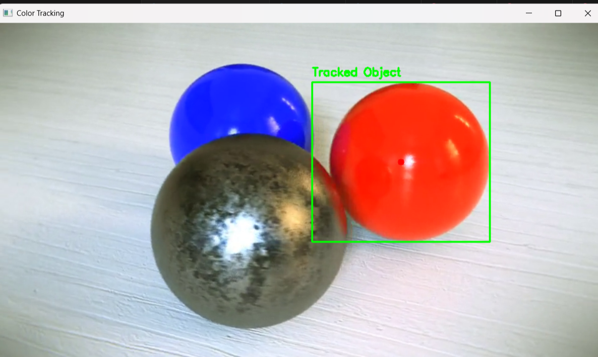
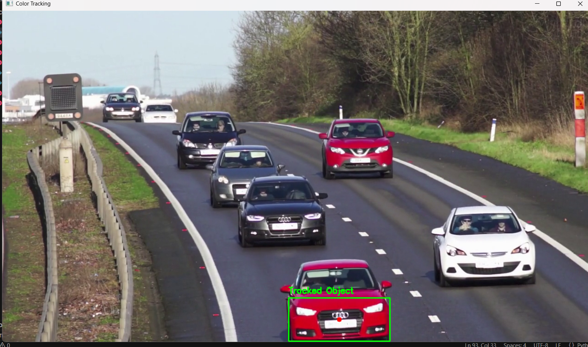

# Color Object Tracker 🎨

A simple real-time color-based object tracking system using OpenCV and Python.

---

## 🎯 Summary

This project tracks the largest object of a specified color (e.g., red) in a video or webcam feed, highlights it with a bounding box and center point, and lets you pause/resume tracking.

---

## ✨ Features

- Real-time object tracking
- HSV color range filtering
- Pause/resume with keyboard
- Simple and customizable

---

## ⚙️ Installation

```bash
pip install opencv-python numpy
```
## 🚀 Usage
Run the tracker:
```bash
python color_tracker.py
```
To use webcam instead of video file:
```bash
python tracker = ColorTracker(0)
```
## Customization
Modify the color range in color_tracker.py:
```bash
python
# For red color detection
self.lower_color1 = np.array([0, 120, 70])
self.upper_color1 = np.array([10, 255, 255])
self.lower_color2 = np.array([170, 120, 70])
self.upper_color2 = np.array([180, 255, 255])
```
## Controls
Press P to pause/resume

Press Q to quit
## 📸 Example Outputs

Tracking a red object in video 1  


Tracking a red object in video 2  



